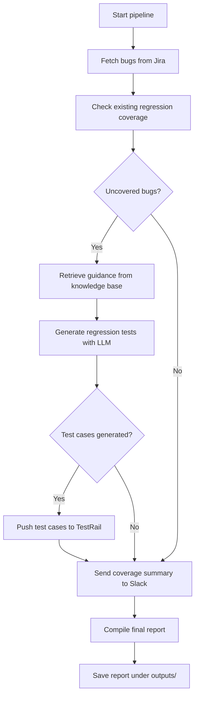

# High-Level Project Flow

```mermaid
flowchart TD
    A[Start pipeline] --> B[Fetch bugs from Jira]
    B --> C[Check existing regression coverage]
    C --> D{Uncovered bugs?}
    D -- Yes --> E[Retrieve guidance from knowledge base]
    E --> F[Generate regression tests with LLM]
    F --> G{Test cases generated?}
    G -- Yes --> H[Push test cases to TestRail]
    G -- No --> I[Send coverage summary to Slack]
    D -- No --> I
    H --> I
    I --> J[Compile final report]
    J --> K[Save report under outputs/]
```
